# **Image Colorization using Autoencoders**
## Description:
    - In this project I tried to train autoencoder from scratch which can colorize grayscale images.
    - For encoder I used Resnet-18 Model [0-6]  and for decoder I used upsampling in pytorch.
    - This project is inspired from paper Colorful Image Colorization by Richard Zhang.
    
## Output:
   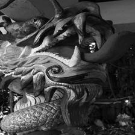 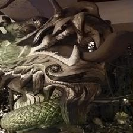
   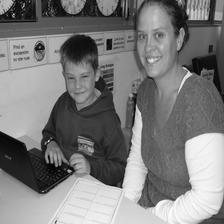 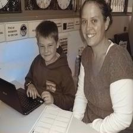
   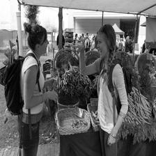 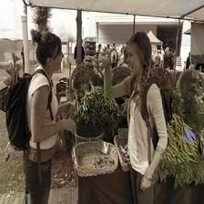
   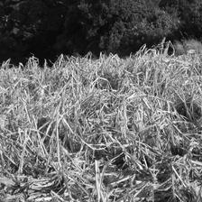 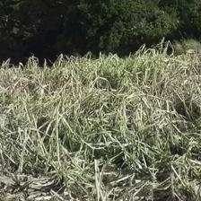
   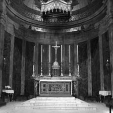 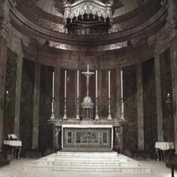
   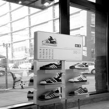 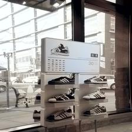
   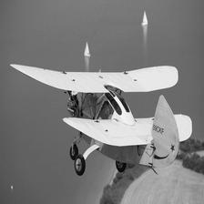 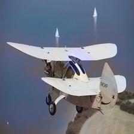
    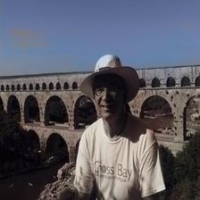
   
## Train and Predict:
    - Use image_colorization.ipynb for training and prediction.
    
## Credits:
    - Richar Zhang paper on Colorful Colorization :
      -> https://arxiv.org/abs/1603.08511
        
    - Luke Melas :
      -> https://lukemelas.github.io/image-colorization.html